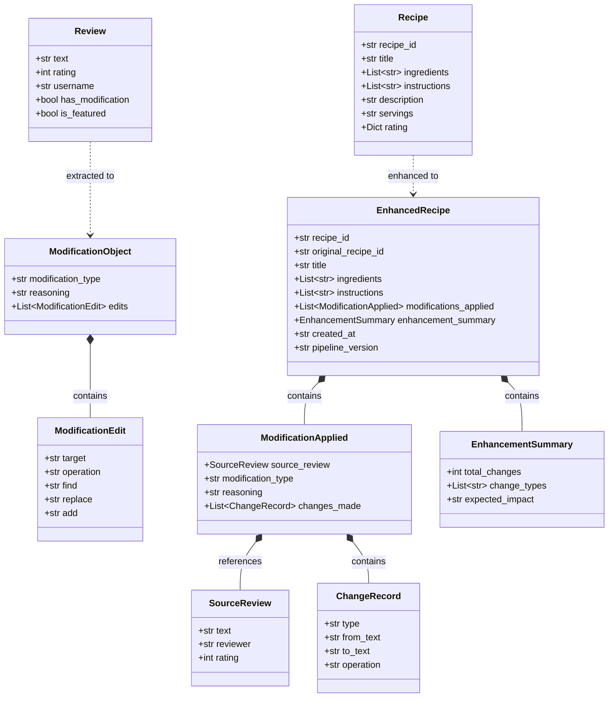
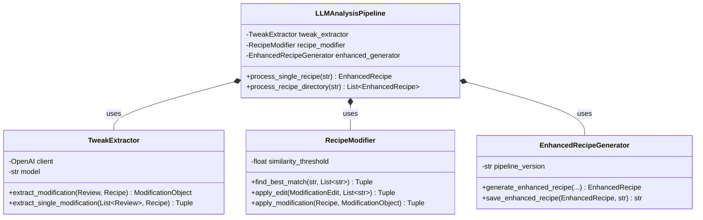
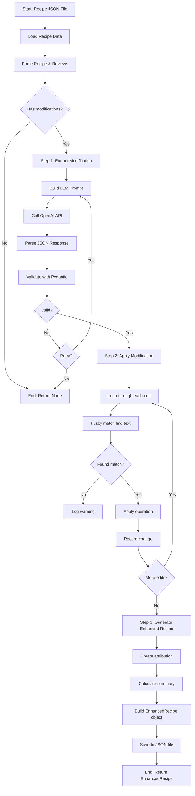
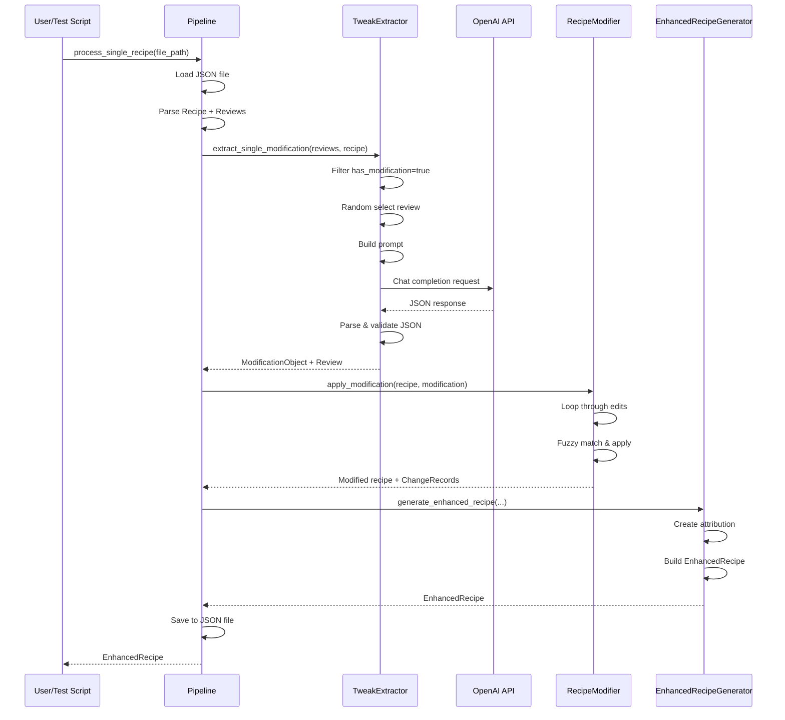

# Recipe Enhancement Platform - Complete Project Deep Dive

> **Last Updated:** September 5, 2026  
> **Project Type:** AI/LLM Engineering Assignment  
> **Time to Complete:** ~4 hours (Debugging & Evaluation Challenge)

---

## 📑 Table of Contents

1. [What is This Project?](#what-is-this-project)
2. [System Architecture](#system-architecture)
3. [Data Structure Deep Dive](#data-structure-deep-dive)
4. [Code Walkthrough - File by File](#code-walkthrough)
5. [Class Diagrams](#class-diagrams)
6. [Data Flow Diagrams](#data-flow-diagrams)
7. [How to Run the Project](#how-to-run-the-project)
8. [Known Bugs & What to Fix](#known-bugs--what-to-fix)
9. [Step-by-Step Execution Flow](#step-by-step-execution-flow)
10. [File Structure](#file-structure)

---

## What is This Project?

### 🎯 One-Line Summary
An AI-powered system that **enhances recipes** by **extracting, validating, and applying** community-tested modifications from AllRecipes.com reviews using **LLM processing**.

### 🔍 What It Does (Example)

**INPUT:** Original chocolate chip cookie recipe + User reviews  
**OUTPUT:** Enhanced recipe with applied modifications + Full citation tracking

#### Example Flow:

```
Original Recipe:
  Ingredients: "1 cup white sugar"

User Review (5 stars):
  "I used a half cup of sugar and one-and-a-half cups of brown sugar. 
   Made the cookies much more chewy and flavorful!"

↓ LLM PROCESSING ↓

Enhanced Recipe:
  Ingredients: "0.5 cup white sugar" + "1.5 cups packed brown sugar"
  
Attribution:
  Source: 5-star review
  Modification Type: quantity_adjustment
  Reasoning: "Makes cookies more chewy and flavorful"
  Changes: [
    - Replaced "1 cup white sugar" → "0.5 cup white sugar"
    - Replaced "1 cup packed brown sugar" → "1.5 cups packed brown sugar"
  ]
```

### 🎓 Why This Project Exists

This is a **debugging and evaluation challenge** for AI engineers. The code was "largely autogenerated by a jr. engineer" and contains **deliberate bugs** that you need to find and fix.

**Key Skills Being Tested:**
1. Understanding LLM applications
2. Working with tech debt/autogenerated code
3. Debugging complex pipelines
4. Building evaluation frameworks
5. User/product thinking
6. Code quality and communication

---

## System Architecture

### 🏗️ High-Level Architecture

```
┌─────────────────────────────────────────────────────────────┐
│                    RECIPE ENHANCEMENT PLATFORM               │
└─────────────────────────────────────────────────────────────┘

┌──────────────┐         ┌──────────────┐         ┌──────────────┐
│   SCRAPER    │  ────▶  │  LLM PIPELINE │  ────▶  │   ENHANCED   │
│   (Optional) │         │   (3 Steps)   │         │   RECIPES    │
└──────────────┘         └──────────────┘         └──────────────┘
       │                        │                        │
       ▼                        ▼                        ▼
  AllRecipes.com         ┌──────────┐             JSON Files with
  Recipe + Reviews       │  Step 1  │             Full Attribution
  as JSON files          │ Extract  │
                         │          │
                         │  Step 2  │
                         │  Modify  │
                         │          │
                         │  Step 3  │
                         │ Generate │
                         └──────────┘
```

### 🔧 Technology Stack

| Component | Technology | Purpose |
|-----------|-----------|---------|
| **Language** | Python 3.13+ | Main programming language |
| **LLM** | OpenAI GPT-3.5-turbo/4o-mini | Extract structured modifications from text |
| **Data Validation** | Pydantic | Ensure data structure correctness |
| **Web Scraping** | BeautifulSoup + requests | Scrape recipes from AllRecipes |
| **Package Manager** | uv | Fast, modern Python package management |
| **Logging** | Loguru | Beautiful, easy logging |
| **String Matching** | difflib.SequenceMatcher | Fuzzy match ingredients/instructions |
| **Environment** | python-dotenv | Manage API keys securely |

---

## Data Structure Deep Dive

### 📊 Data Flow Through the System

```
┌────────────────────────────────────────────────────────────┐
│                   DATA TRANSFORMATION                       │
└────────────────────────────────────────────────────────────┘

1. RAW JSON (from scraper)
   ↓
2. Recipe + Review Objects (Pydantic models)
   ↓
3. ModificationObject (extracted by LLM)
   ↓
4. Modified Recipe + ChangeRecords (applied modifications)
   ↓
5. EnhancedRecipe (final output with attribution)
```

### 📄 Sample Data Structure

#### 1. **Input: Scraped Recipe JSON**

Location: `data/recipe_10813_best-chocolate-chip-cookies.json`

```json
{
  "recipe_id": "10813",
  "title": "Best Chocolate Chip Cookies",
  "description": "This classic chocolate chip cookie recipe...",
  "ingredients": [
    "1 cup butter, softened",
    "1 cup white sugar",
    "1 cup packed brown sugar",
    "2 eggs"
  ],
  "instructions": [
    "Preheat the oven to 350 degrees F (175 degrees C)",
    "Beat butter, white sugar, and brown sugar..."
  ],
  "rating": {
    "value": "4.6",
    "count": "19353"
  },
  "featured_tweaks": [
    {
      "text": "I used a half cup of sugar...",
      "rating": 5,
      "has_modification": true,
      "is_featured": true
    }
  ],
  "reviews": [
    {
      "text": "I used a half cup of sugar...",
      "rating": 5,
      "has_modification": true
    }
  ]
}
```

**Key Fields:**
- `recipe_id`: Unique identifier from AllRecipes
- `ingredients`: List of ingredient strings
- `instructions`: List of instruction steps
- `featured_tweaks`: **IMPORTANT** - Curated modifications marked by AllRecipes
- `reviews`: All reviews, some with `has_modification: true`

#### 2. **Intermediate: ModificationObject (from LLM)**

```json
{
  "modification_type": "quantity_adjustment",
  "reasoning": "Makes cookies more chewy and flavorful by increasing brown sugar ratio",
  "edits": [
    {
      "target": "ingredients",
      "operation": "replace",
      "find": "1 cup white sugar",
      "replace": "0.5 cup white sugar"
    },
    {
      "target": "ingredients",
      "operation": "replace",
      "find": "1 cup packed brown sugar",
      "replace": "1.5 cups packed brown sugar"
    }
  ]
}
```

**Modification Types:**
- `ingredient_substitution`: Replace one ingredient with another
- `quantity_adjustment`: Change amounts
- `technique_change`: Alter cooking method/temp/time
- `addition`: Add new ingredients/steps
- `removal`: Remove ingredients/steps

**Operations:**
- `replace`: Find text and replace it
- `add_after`: Add new text after target
- `remove`: Delete matching text

#### 3. **Output: Enhanced Recipe JSON**

Location: `src/data/enhanced/enhanced_10813_best-chocolate-chip-cookies.json`

```json
{
  "recipe_id": "10813_enhanced",
  "original_recipe_id": "10813",
  "title": "Best Chocolate Chip Cookies (Community Enhanced)",
  "ingredients": [
    "1 cup butter, softened",
    "0.5 cup white sugar",         // ← CHANGED
    "1.5 cups packed brown sugar", // ← CHANGED
    "2 eggs"
  ],
  "instructions": [/* ... */],
  "modifications_applied": [
    {
      "source_review": {
        "text": "I used a half cup of sugar...",
        "reviewer": "JohnDoe",
        "rating": 5
      },
      "modification_type": "quantity_adjustment",
      "reasoning": "Makes cookies more chewy and flavorful",
      "changes_made": [
        {
          "type": "ingredient",
          "from_text": "1 cup white sugar",
          "to_text": "0.5 cup white sugar",
          "operation": "replace"
        },
        {
          "type": "ingredient",
          "from_text": "1 cup packed brown sugar",
          "to_text": "1.5 cups packed brown sugar",
          "operation": "replace"
        }
      ]
    }
  ],
  "enhancement_summary": {
    "total_changes": 2,
    "change_types": ["quantity_adjustment"],
    "expected_impact": "Makes cookies more chewy and flavorful"
  },
  "created_at": "2026-09-05T10:30:00",
  "pipeline_version": "1.0.0"
}
```

**Key Features:**
- Full attribution to source review
- Line-by-line change tracking
- Expected impact summary
- Version tracking

---

## Code Walkthrough

### 📁 File Structure

```
ai-eng-assignment/
├── src/
│   ├── llm_pipeline/
│   │   ├── __init__.py
│   │   ├── models.py              # Pydantic data models
│   │   ├── prompts.py             # LLM prompt templates
│   │   ├── tweak_extractor.py     # Step 1: Extract modifications
│   │   ├── recipe_modifier.py     # Step 2: Apply modifications
│   │   ├── enhanced_recipe_generator.py  # Step 3: Generate output
│   │   └── pipeline.py            # Main orchestrator
│   ├── scraper_v2.py              # Web scraper (optional)
│   └── test_pipeline.py           # Test script
├── data/
│   ├── recipe_*.json              # Scraped recipes (5 included)
│   └── enhanced/                  # Output directory
├── .env                           # API keys (YOU CREATE THIS)
├── pyproject.toml                 # Dependencies
└── README.md
```

---

## 🔍 Detailed Code Walkthrough - File by File

### 1. `models.py` - Data Models (Pydantic)

**Purpose:** Define the structure of all data objects in the system.

**File:** `src/llm_pipeline/models.py` (145 lines)

#### Class Hierarchy:

```
ModificationEdit          # Atomic edit operation
    ↓
ModificationObject        # Complete modification (1+ edits)
    ↓
Recipe                    # Base recipe
Review                    # User review
    ↓
ChangeRecord              # Record of actual change made
SourceReview              # Attribution info
    ↓
ModificationApplied       # Modification + changes + source
    ↓
EnhancementSummary        # Summary statistics
    ↓
EnhancedRecipe            # Final output
```

#### Key Classes Explained:

**A. ModificationEdit** (Lines 13-30)
```python
class ModificationEdit(BaseModel):
    target: Literal["ingredients", "instructions"]  # Where to apply
    operation: Literal["replace", "add_after", "remove"]  # What to do
    find: str  # Text to find
    replace: Optional[str] = None  # For replace operations
    add: Optional[str] = None  # For add_after operations
```

**Example:**
```python
edit = ModificationEdit(
    target="ingredients",
    operation="replace",
    find="1 cup white sugar",
    replace="0.5 cup white sugar"
)
```

**B. ModificationObject** (Lines 32-46)
```python
class ModificationObject(BaseModel):
    modification_type: Literal[
        "ingredient_substitution",
        "quantity_adjustment",
        "technique_change",
        "addition",
        "removal"
    ]
    reasoning: str  # Why this improves the recipe
    edits: List[ModificationEdit]  # 1 or more edits
```

**Example:**
```python
modification = ModificationObject(
    modification_type="quantity_adjustment",
    reasoning="Makes cookies more chewy",
    edits=[edit1, edit2]
)
```

**C. Recipe** (Lines 125-136)
```python
class Recipe(BaseModel):
    recipe_id: str
    title: str
    ingredients: List[str]  # ["1 cup butter", "2 eggs", ...]
    instructions: List[str]  # ["Preheat oven", "Mix butter", ...]
    description: Optional[str] = None
    servings: Optional[str] = None
    rating: Optional[Dict[str, Any]] = None
```

**D. Review** (Lines 138-145)
```python
class Review(BaseModel):
    text: str
    rating: Optional[int] = None
    username: Optional[str] = None
    has_modification: bool = False  # Key flag!
```

**E. EnhancedRecipe** (Lines 92-123)
```python
class EnhancedRecipe(BaseModel):
    recipe_id: str  # e.g., "10813_enhanced"
    original_recipe_id: str  # e.g., "10813"
    title: str
    ingredients: List[str]  # Modified ingredients
    instructions: List[str]  # Modified instructions
    modifications_applied: List[ModificationApplied]  # Full attribution
    enhancement_summary: EnhancementSummary
    created_at: str
    pipeline_version: str = "1.0.0"
```

**Why Pydantic?**
1. ✅ **Automatic validation** - Wrong data types? Error immediately
2. ✅ **Type hints** - IDE autocomplete works
3. ✅ **Easy serialization** - `.model_dump()` converts to dict/JSON
4. ✅ **LLM output parsing** - Validate JSON from GPT

---

### 2. `prompts.py` - LLM Prompts

**Purpose:** Craft prompts that instruct the LLM to extract structured modifications.

**File:** `src/llm_pipeline/prompts.py` (226 lines)

#### Key Components:

**A. System Prompt** (Lines 8-29)
```python
SYSTEM_PROMPT = """You are an expert recipe analyst. Your job is to extract 
structured recipe modifications from user reviews.

When a user shares their experience modifying a recipe, you need to:
1. Identify exactly what changes they made
2. Understand why they made those changes
3. Convert their modifications into structured edit operations

You must output valid JSON that matches the ModificationObject schema.

Categories:
- "ingredient_substitution": Replacing one ingredient with another
- "quantity_adjustment": Changing amounts of existing ingredients
- "technique_change": Altering cooking method, temperature, time
- "addition": Adding new ingredients or steps
- "removal": Removing ingredients or steps

Edit operations:
- "replace": Find existing text and replace it
- "add_after": Add new text after finding target text
- "remove": Remove text that matches the find pattern

Be precise with text matching - use the exact text from the original recipe."""
```

**B. Extraction Prompt Template** (Lines 31-55)
```python
EXTRACTION_PROMPT = """Original Recipe:
Title: {title}
Ingredients: {ingredients}
Instructions: {instructions}

User Review: "{review_text}"

Extract the recipe modifications from this review. The user has made changes 
to improve the recipe.

Output a JSON object with this structure:
{{
    "modification_type": "quantity_adjustment|ingredient_substitution|...",
    "reasoning": "Brief explanation of why this modification improves the recipe",
    "edits": [
        {{
            "target": "ingredients|instructions",
            "operation": "replace|add_after|remove",
            "find": "exact text to find",
            "replace": "replacement text (for replace operations)",
            "add": "text to add (for add_after operations)"
        }}
    ]
}}

Focus on concrete changes the user actually made, not general suggestions."""
```

**C. Few-Shot Examples** (Lines 57-156)

These are example input/output pairs shown to the LLM to guide its behavior:

```python
FEW_SHOT_EXAMPLES = [
    {
        "review": "I used a half cup of sugar and one-and-a-half cups of brown sugar instead of the recipe amounts. Made the cookies much more chewy and flavorful!",
        "ingredients": [
            "1 cup butter, softened",
            "1 cup white sugar",
            "1 cup packed brown sugar",
            "2 eggs"
        ],
        "expected_output": {
            "modification_type": "quantity_adjustment",
            "reasoning": "Makes cookies more chewy and flavorful by increasing brown sugar ratio",
            "edits": [
                {
                    "target": "ingredients",
                    "operation": "replace",
                    "find": "1 cup white sugar",
                    "replace": "0.5 cup white sugar"
                },
                {
                    "target": "ingredients",
                    "operation": "replace",
                    "find": "1 cup packed brown sugar",
                    "replace": "1.5 cups packed brown sugar"
                }
            ]
        }
    },
    # ... 3 more examples
]
```

**D. Prompt Builder Functions**

```python
def build_simple_prompt(review_text, title, ingredients, instructions):
    """Build a simple prompt without examples."""
    return f"""{SYSTEM_PROMPT}
    
    Original Recipe:
    Title: {title}
    Ingredients: {ingredients}
    Instructions: {instructions}
    
    User Review: "{review_text}"
    
    Extract the recipe modifications...
    """

def build_few_shot_prompt(review_text, title, ingredients, instructions):
    """Build a prompt with examples for better accuracy."""
    examples_text = "\n\n".join([format_example(ex) for ex in FEW_SHOT_EXAMPLES[:2]])
    
    return f"""{SYSTEM_PROMPT}
    
    Here are some examples:
    {examples_text}
    
    Now extract from this review:
    {EXTRACTION_PROMPT.format(...)}
    """
```

**Prompt Engineering Techniques Used:**
1. ✅ **Clear role definition** - "You are an expert recipe analyst"
2. ✅ **Step-by-step instructions** - Numbered list of tasks
3. ✅ **Schema definition** - Exact JSON format expected
4. ✅ **Few-shot learning** - 4 examples provided
5. ✅ **Constraint specification** - "use exact text from original recipe"

---

### 3. `tweak_extractor.py` - Step 1: Extract Modifications

**Purpose:** Use OpenAI API to extract structured modifications from review text.

**File:** `src/llm_pipeline/tweak_extractor.py` (169 lines)

#### Class: TweakExtractor

**A. Initialization** (Lines 24-34)
```python
class TweakExtractor:
    def __init__(self, api_key: Optional[str] = None, model: str = "gpt-3.5-turbo"):
        """
        Initialize the TweakExtractor.
        
        Args:
            api_key: OpenAI API key (defaults to OPENAI_API_KEY env var)
            model: OpenAI model to use (default: gpt-3.5-turbo)
        """
        self.client = OpenAI(api_key=api_key or os.getenv("OPENAI_API_KEY"))
        self.model = model
        logger.info(f"Initialized TweakExtractor with model: {model}")
```

**What this does:**
- Creates an OpenAI client
- Loads API key from environment or parameter
- Sets the model (gpt-3.5-turbo or gpt-4o-mini)

**B. extract_modification()** (Lines 36-111) - **CORE FUNCTION**

```python
def extract_modification(
    self,
    review: Review,
    recipe: Recipe,
    max_retries: int = 2
) -> Optional[ModificationObject]:
    """
    Extract a structured modification from a review.
    
    Args:
        review: Review object containing modification text
        recipe: Original recipe being modified
        max_retries: Number of retry attempts if parsing fails
    
    Returns:
        ModificationObject if extraction successful, None otherwise
    """
    
    # 1. Check if review has modifications
    if not review.has_modification:
        logger.warning("Review has no modification flag set")
        return None
    
    # 2. Build the prompt
    prompt = build_simple_prompt(
        review.text, 
        recipe.title, 
        recipe.ingredients, 
        recipe.instructions
    )
    
    logger.debug(f"Extracting modification from review: {review.text[:100]}...")
    
    # 3. Call OpenAI API with retries
    for attempt in range(max_retries + 1):
        try:
            # Make API call
            response = self.client.chat.completions.create(
                model=self.model,
                messages=[{"role": "user", "content": prompt}],
                response_format={"type": "json_object"},  # Force JSON output
                temperature=0.1,  # Low temp = consistent output
                max_tokens=1000
            )
            
            # Get raw response
            raw_output = response.choices[0].message.content
            logger.debug(f"LLM raw output: {raw_output}")
            
            # 4. Parse JSON
            if not raw_output:
                logger.warning(f"Attempt {attempt + 1}: Empty response from LLM")
                continue
            
            modification_data = json.loads(raw_output)
            
            # 5. Validate with Pydantic
            modification = ModificationObject(**modification_data)
            
            logger.info(
                f"Successfully extracted {modification.modification_type} "
                f"modification with {len(modification.edits)} edits"
            )
            return modification
        
        except json.JSONDecodeError as e:
            logger.warning(f"Attempt {attempt + 1}: Failed to parse JSON: {e}")
            if attempt == max_retries:
                logger.error(f"Max retries reached. Raw output: {raw_output}")
        
        except ValidationError as e:
            logger.warning(f"Attempt {attempt + 1}: Validation error: {e}")
            if attempt == max_retries:
                logger.error(f"Max retries reached. Invalid data: {modification_data}")
        
        except Exception as e:
            logger.error(f"Attempt {attempt + 1}: Unexpected error: {e}")
            if attempt == max_retries:
                return None
    
    return None
```

**Step-by-Step Breakdown:**

1. **Validation** (Line 53-55)
   - Check if review actually has `has_modification: true`
   - Return None if not

2. **Prompt Building** (Lines 58-60)
   - Call `build_simple_prompt()` from prompts.py
   - Inserts recipe and review text into template

3. **API Call** (Lines 66-74)
   - `response_format={"type": "json_object"}` - **Forces JSON output**
   - `temperature=0.1` - Low randomness for consistency
   - `max_tokens=1000` - Limit response length

4. **JSON Parsing** (Lines 76-85)
   - Get raw text from response
   - Parse as JSON with `json.loads()`
   - Handles empty responses

5. **Pydantic Validation** (Lines 86-91)
   - `ModificationObject(**modification_data)` validates structure
   - Ensures all required fields present
   - Checks types (string, int, etc.)

6. **Error Handling** (Lines 94-109)
   - **JSONDecodeError**: Invalid JSON format
   - **ValidationError**: JSON doesn't match schema
   - **Generic Exception**: Any other error
   - Retries up to `max_retries` times

**C. extract_single_modification()** (Lines 113-145) - **🐛 BUG HERE**

```python
def extract_single_modification(
    self, 
    reviews: list[Review], 
    recipe: Recipe
) -> tuple[ModificationObject, Review] | tuple[None, None]:
    """
    Extract modification from a single randomly selected review.
    
    Returns:
        Tuple of (ModificationObject, source_Review) if successful
    """
    import random
    
    # Filter to reviews with modifications
    modification_reviews = [r for r in reviews if r.has_modification]
    
    if not modification_reviews:
        logger.warning("No reviews with modifications found")
        return None, None
    
    # 🐛 BUG: Random selection instead of featured reviews
    selected_review = random.choice(modification_reviews)  # LINE 136
    logger.info(f"Selected review: {selected_review.text[:100]}...")
    
    # Extract modification
    modification = self.extract_modification(selected_review, recipe)
    
    if modification:
        logger.info("Successfully extracted modification from selected review")
        return modification, selected_review
    else:
        logger.warning("Failed to extract modification from selected review")
        return None, None
```

**🐛 BUG #1: Random Selection**
- **Line 136**: `random.choice(modification_reviews)`
- **Should prioritize**: Reviews with `is_featured: true`
- **Current behavior**: Treats all modifications equally
- **Impact**: Ignores AllRecipes' curated "Featured Tweaks"

**How to fix:**
```python
# Filter for featured reviews first
featured_reviews = [r for r in modification_reviews if getattr(r, 'is_featured', False)]

if featured_reviews:
    selected_review = featured_reviews[0]  # Or random.choice(featured_reviews)
else:
    # Fallback to highest-rated
    selected_review = max(modification_reviews, key=lambda r: r.rating or 0)
```

---

### 4. `recipe_modifier.py` - Step 2: Apply Modifications

**Purpose:** Apply extracted modifications to the recipe using fuzzy string matching.

**File:** `src/llm_pipeline/recipe_modifier.py` (258 lines)

#### Class: RecipeModifier

**A. Initialization** (Lines 25-33)
```python
class RecipeModifier:
    def __init__(self, similarity_threshold: float = 0.6):
        """
        Args:
            similarity_threshold: Minimum similarity score for fuzzy matching (0-1)
                                 0.6 = 60% similar
        """
        self.similarity_threshold = similarity_threshold
        logger.info(f"Initialized RecipeModifier with threshold: {similarity_threshold}")
```

**What is similarity_threshold?**
- Used for **fuzzy string matching**
- Compares strings like "1 cup butter" vs "1c butter, softened"
- 0.6 means 60% similarity required to match
- Lower = more lenient, Higher = more strict

**B. find_best_match()** (Lines 35-63) - **Fuzzy Matching Logic**

```python
def find_best_match(
    self, 
    target: str, 
    candidates: List[str]
) -> Tuple[Optional[str], Optional[int], float]:
    """
    Find the best matching string in a list of candidates.
    
    Args:
        target: String to find (e.g., "1 cup white sugar")
        candidates: List of strings to search in (recipe ingredients)
    
    Returns:
        Tuple of (best_match, index, similarity_score)
    """
    if not candidates:
        return None, None, 0.0
    
    best_match = None
    best_index = None
    best_score = 0.0
    
    # Try each candidate
    for i, candidate in enumerate(candidates):
        # Calculate similarity (0.0 to 1.0)
        similarity = SequenceMatcher(
            None, 
            target.lower(), 
            candidate.lower()
        ).ratio()
        
        # Keep track of best match
        if similarity > best_score:
            best_score = similarity
            best_match = candidate
            best_index = i
    
    # Only return if above threshold
    if best_score >= self.similarity_threshold:
        return best_match, best_index, best_score
    else:
        return None, None, best_score
```

**How SequenceMatcher works:**

```python
# Example 1: Exact match
SequenceMatcher(None, "1 cup butter", "1 cup butter").ratio()
# Returns: 1.0 (100% match)

# Example 2: Close match
SequenceMatcher(None, "1 cup butter", "1 cup butter, softened").ratio()
# Returns: 0.75 (75% match) - still matches if threshold is 0.6

# Example 3: Poor match
SequenceMatcher(None, "1 cup butter", "2 eggs").ratio()
# Returns: 0.15 (15% match) - won't match
```

**C. apply_edit()** (Lines 65-141) - **Apply Single Edit**

```python
def apply_edit(
    self,
    edit: ModificationEdit,
    recipe_content: List[str]
) -> Tuple[List[str], List[ChangeRecord]]:
    """
    Apply a single edit to a recipe content list.
    
    Returns:
        Tuple of (modified_content, change_records)
    """
    modified_content = copy.deepcopy(recipe_content)
    change_records = []
    
    logger.debug(f"Applying {edit.operation} edit: find='{edit.find}'")
    
    if edit.operation == "replace":
        # Find and replace text
        match, index, score = self.find_best_match(edit.find, modified_content)
        
        if match and index is not None:
            original_text = modified_content[index]
            new_text = original_text.replace(edit.find, edit.replace or "")
            modified_content[index] = new_text
            
            change_records.append(ChangeRecord(
                type="ingredient" if edit.target == "ingredients" else "instruction",
                from_text=original_text,
                to_text=new_text,
                operation="replace"
            ))
            
            logger.info(f"Replaced '{edit.find}' with '{edit.replace}' (similarity: {score:.2f})")
        else:
            logger.warning(f"Could not find '{edit.find}' (best similarity: {score:.2f})")
    
    elif edit.operation == "add_after":
        # Add new content after finding target
        match, index, score = self.find_best_match(edit.find, modified_content)
        
        if match and index is not None and edit.add:
            modified_content.insert(index + 1, edit.add)
            
            change_records.append(ChangeRecord(
                type="ingredient" if edit.target == "ingredients" else "instruction",
                from_text="",
                to_text=edit.add,
                operation="add"
            ))
            
            logger.info(f"Added '{edit.add}' after '{edit.find}' (similarity: {score:.2f})")
        else:
            logger.warning(f"Could not find target '{edit.find}' for addition")
    
    elif edit.operation == "remove":
        # Remove matching content
        match, index, score = self.find_best_match(edit.find, modified_content)
        
        if match and index is not None:
            removed_text = modified_content.pop(index)
            
            change_records.append(ChangeRecord(
                type="ingredient" if edit.target == "ingredients" else "instruction",
                from_text=removed_text,
                to_text="",
                operation="remove"
            ))
            
            logger.info(f"Removed '{edit.find}' (similarity: {score:.2f})")
        else:
            logger.warning(f"Could not find '{edit.find}' to remove")
    
    return modified_content, change_records
```

**Three Operations Explained:**

**1. REPLACE:**
```python
# Original: ["1 cup butter", "1 cup white sugar", "2 eggs"]
# Edit: replace "1 cup white sugar" with "0.5 cup white sugar"
# Result: ["1 cup butter", "0.5 cup white sugar", "2 eggs"]
```

**2. ADD_AFTER:**
```python
# Original: ["1 tsp baking soda", "0.5 tsp salt"]
# Edit: add "1 tsp cream of tartar" after "0.5 tsp salt"
# Result: ["1 tsp baking soda", "0.5 tsp salt", "1 tsp cream of tartar"]
```

**3. REMOVE:**
```python
# Original: ["1 cup butter", "2 tsp hot water", "0.5 tsp salt"]
# Edit: remove "2 tsp hot water"
# Result: ["1 cup butter", "0.5 tsp salt"]
```

**D. apply_modification()** (Lines 143-190) - **Apply Complete Modification**

```python
def apply_modification(
    self,
    recipe: Recipe,
    modification: ModificationObject
) -> Tuple[Recipe, List[ChangeRecord]]:
    """
    Apply a complete modification to a recipe.
    """
    logger.info(f"Applying {modification.modification_type} with {len(modification.edits)} edits")
    
    # Deep copy the recipe (don't modify original)
    modified_recipe = Recipe(
        recipe_id=f"{recipe.recipe_id}_modified",
        title=recipe.title,
        ingredients=copy.deepcopy(recipe.ingredients),
        instructions=copy.deepcopy(recipe.instructions),
        description=recipe.description,
        servings=recipe.servings,
        rating=recipe.rating
    )
    
    all_change_records = []
    
    # Apply each edit
    for edit in modification.edits:
        if edit.target == "ingredients":
            modified_recipe.ingredients, change_records = self.apply_edit(
                edit, modified_recipe.ingredients
            )
        elif edit.target == "instructions":
            modified_recipe.instructions, change_records = self.apply_edit(
                edit, modified_recipe.instructions
            )
        else:
            logger.warning(f"Unknown edit target: {edit.target}")
            continue
        
        all_change_records.extend(change_records)
    
    logger.info(f"Applied modification successfully: {len(all_change_records)} changes made")
    return modified_recipe, all_change_records
```

**Step-by-Step:**
1. Create deep copy of recipe (don't mutate original)
2. Loop through each edit in the modification
3. Apply edit to either ingredients or instructions
4. Collect all change records
5. Return modified recipe + change records

---

### 5. `enhanced_recipe_generator.py` - Step 3: Generate Output

**Purpose:** Create the final enhanced recipe with full attribution and metadata.

**File:** `src/llm_pipeline/enhanced_recipe_generator.py` (251 lines)

#### Class: EnhancedRecipeGenerator

**A. generate_enhanced_recipe()** (Lines 111-170) - **Main Function**

```python
def generate_enhanced_recipe(
    self,
    original_recipe: Recipe,
    modified_recipe: Recipe,
    modification: ModificationObject,
    source_review: Review,
    change_records: List[ChangeRecord]
) -> EnhancedRecipe:
    """
    Generate a complete enhanced recipe with attribution.
    """
    logger.info(f"Generating enhanced recipe for: {original_recipe.title}")
    
    # 1. Create modification applied record
    modification_applied = self.create_modification_applied(
        modification, source_review, change_records
    )
    modifications_applied = [modification_applied]
    
    # 2. Calculate enhancement summary
    enhancement_summary = self.calculate_enhancement_summary(modifications_applied)
    
    # 3. Generate enhanced recipe ID and title
    enhanced_recipe_id = f"{original_recipe.recipe_id}_enhanced"
    enhanced_title = f"{original_recipe.title} (Community Enhanced)"
    
    # 4. Create the enhanced recipe
    enhanced_recipe = EnhancedRecipe(
        recipe_id=enhanced_recipe_id,
        original_recipe_id=original_recipe.recipe_id,
        title=enhanced_title,
        ingredients=modified_recipe.ingredients,  # Modified version
        instructions=modified_recipe.instructions,  # Modified version
        modifications_applied=modifications_applied,  # Full attribution
        enhancement_summary=enhancement_summary,  # Summary stats
        description=original_recipe.description,
        servings=original_recipe.servings,
        created_at=datetime.now().isoformat(),
        pipeline_version=self.pipeline_version
    )
    
    logger.info(f"Generated enhanced recipe with {enhancement_summary.total_changes} changes")
    
    return enhanced_recipe
```

**B. save_enhanced_recipe()** (Lines 226-250)

```python
def save_enhanced_recipe(
    self, 
    enhanced_recipe: EnhancedRecipe, 
    output_path: str
) -> str:
    """Save enhanced recipe to JSON file."""
    import json
    import os
    
    # Ensure output directory exists
    os.makedirs(os.path.dirname(output_path), exist_ok=True)
    
    # Convert to dict and save
    with open(output_path, "w", encoding="utf-8") as f:
        json.dump(enhanced_recipe.model_dump(), f, indent=2, ensure_ascii=False)
    
    logger.info(f"Saved enhanced recipe to: {output_path}")
    return output_path
```

**Key Method:**
- `enhanced_recipe.model_dump()` - Pydantic method to convert to dict
- `indent=2` - Pretty-print JSON
- `ensure_ascii=False` - Support unicode characters

---

### 6. `pipeline.py` - Main Orchestrator

**Purpose:** Coordinate all 3 steps and handle batch processing.

**File:** `src/llm_pipeline/pipeline.py` (302 lines)

#### Class: LLMAnalysisPipeline

**A. Initialization** (Lines 28-56)

```python
class LLMAnalysisPipeline:
    def __init__(
        self,
        openai_api_key: Optional[str] = None,
        output_dir: str = "data/enhanced",
        pipeline_version: str = "1.0.0"
    ):
        # Load environment variables
        load_dotenv()
        
        self.output_dir = Path(output_dir)
        self.output_dir.mkdir(parents=True, exist_ok=True)
        
        # Initialize pipeline components
        self.tweak_extractor = TweakExtractor(api_key=openai_api_key)
        self.recipe_modifier = RecipeModifier()
        self.enhanced_generator = EnhancedRecipeGenerator(
            pipeline_version=pipeline_version
        )
        
        logger.info(f"Initialized LLM Analysis Pipeline v{pipeline_version}")
        logger.info(f"Output directory: {self.output_dir}")
```

**Components Created:**
1. `TweakExtractor` - Extracts modifications using LLM
2. `RecipeModifier` - Applies modifications to recipes
3. `EnhancedRecipeGenerator` - Generates final output

**B. process_single_recipe()** (Lines 116-194) - **MAIN PROCESSING LOGIC**

```python
def process_single_recipe(
    self, 
    recipe_file: str, 
    save_output: bool = True
) -> Optional[EnhancedRecipe]:
    """Process a single recipe through the complete pipeline."""
    
    try:
        logger.info(f"Processing recipe file: {recipe_file}")
        
        # ═══════════════════════════════════════════════════════
        # STEP 0: Load and parse data
        # ═══════════════════════════════════════════════════════
        recipe_data = self.load_recipe_data(recipe_file)
        recipe = self.parse_recipe_data(recipe_data)
        reviews = self.parse_reviews_data(recipe_data)
        
        logger.info(f"Loaded recipe: {recipe.title}")
        logger.info(
            f"Found {len(reviews)} reviews, "
            f"{len([r for r in reviews if r.has_modification])} with modifications"
        )
        
        if not any(r.has_modification for r in reviews):
            logger.warning("No reviews with modifications found")
            return None
        
        # ═══════════════════════════════════════════════════════
        # STEP 1: Extract modification from one random review
        # ═══════════════════════════════════════════════════════
        logger.info("Step 1: Extracting modification from a single review...")
        modification, source_review = (
            self.tweak_extractor.extract_single_modification(reviews, recipe)
        )
        
        if not modification or not source_review:
            logger.warning("No modification could be extracted")
            return None
        
        logger.info(f"Successfully extracted {modification.modification_type} modification")
        
        # ═══════════════════════════════════════════════════════
        # STEP 2: Apply modification to recipe
        # ═══════════════════════════════════════════════════════
        logger.info("Step 2: Applying modification to recipe...")
        modified_recipe, change_records = self.recipe_modifier.apply_modification(
            recipe, modification
        )
        
        logger.info(f"Applied modification: {len(change_records)} total changes made")
        
        # ═══════════════════════════════════════════════════════
        # STEP 3: Generate enhanced recipe with attribution
        # ═══════════════════════════════════════════════════════
        logger.info("Step 3: Generating enhanced recipe with attribution...")
        
        enhanced_recipe = self.enhanced_generator.generate_enhanced_recipe(
            recipe, modified_recipe, modification, source_review, change_records
        )
        
        logger.info(f"Generated enhanced recipe: {enhanced_recipe.title}")
        
        # ═══════════════════════════════════════════════════════
        # SAVE OUTPUT
        # ═══════════════════════════════════════════════════════
        if save_output:
            output_filename = (
                f"enhanced_{recipe.recipe_id}_"
                f"{recipe.title.lower().replace(' ', '-')[:30]}.json"
            )
            output_path = self.output_dir / output_filename
            self.enhanced_generator.save_enhanced_recipe(
                enhanced_recipe, str(output_path)
            )
        
        return enhanced_recipe
    
    except Exception as e:
        logger.error(f"Failed to process recipe {recipe_file}: {e}")
        import traceback
        traceback.print_exc()
        return None
```

**🐛 BUG #2: Single Review Processing**
- **Line 148-149**: `extract_single_modification()` - Only processes ONE review
- **Should process**: ALL featured modifications (or top N)
- **Current behavior**: One enhancement per recipe
- **Impact**: Misses valuable community improvements

**C. process_recipe_directory()** (Lines 196-227)

```python
def process_recipe_directory(self, data_dir: str = "data") -> List[EnhancedRecipe]:
    """Process all recipe files in a directory."""
    
    data_path = Path(data_dir)
    recipe_files = list(data_path.glob("recipe_*.json"))
    
    logger.info(f"Found {len(recipe_files)} recipe files to process")
    
    enhanced_recipes = []
    for recipe_file in recipe_files:
        logger.info(f"\n{'=' * 60}")
        enhanced_recipe = self.process_single_recipe(str(recipe_file))
        
        if enhanced_recipe:
            enhanced_recipes.append(enhanced_recipe)
            logger.info(f"✓ Successfully processed: {enhanced_recipe.title}")
        else:
            logger.warning(f"✗ Failed to process: {recipe_file.name}")
    
    logger.info(f"\n{'=' * 60}")
    logger.info(
        f"Pipeline complete: {len(enhanced_recipes)}/{len(recipe_files)} "
        f"recipes successfully enhanced"
    )
    
    return enhanced_recipes
```

---

### 7. `test_pipeline.py` - Test Script

**Purpose:** Entry point to run the pipeline.

**File:** `src/test_pipeline.py` (161 lines)

**Usage:**
```bash
# Test single recipe (chocolate chip cookies)
python test_pipeline.py single

# Process all recipes
python test_pipeline.py all
```

**Key Functions:**

```python
def test_single_recipe():
    """Test the pipeline with the chocolate chip cookie recipe."""
    
    # Check for API key
    if not os.getenv("OPENAI_API_KEY"):
        logger.error("OPENAI_API_KEY environment variable not set")
        return False
    
    # Initialize pipeline
    pipeline = LLMAnalysisPipeline()
    
    # Test with chocolate chip cookie recipe
    recipe_file = "../data/recipe_10813_best-chocolate-chip-cookies.json"
    
    # Process the recipe
    enhanced_recipe = pipeline.process_single_recipe(
        recipe_file=recipe_file,
        save_output=True
    )
    
    if enhanced_recipe:
        logger.success("✓ Single recipe test successful!")
        logger.info(f"Enhanced recipe: {enhanced_recipe.title}")
        logger.info(f"Modifications applied: {len(enhanced_recipe.modifications_applied)}")
        logger.info(f"Total changes: {enhanced_recipe.enhancement_summary.total_changes}")
        return True
    else:
        logger.error("✗ Single recipe test failed")
        return False
```

---

## Class Diagrams

### 📊 Data Model Class Diagram (Mermaid)



### 📊 Pipeline Components Diagram



---

## Data Flow Diagrams

### 🔄 Complete Pipeline Flow



### 🔄 Single Recipe Processing Flow



---

## How to Run the Project

### ✅ Prerequisites

1. **Python 3.13+**
   ```bash
   python --version  # Check version
   ```

2. **uv package manager**
   ```bash
   # Install uv
   curl -LsSf https://astral.sh/uv/install.sh | sh
   ```

3. **OpenAI API Key**
   - Go to: https://platform.openai.com/api-keys
   - Create new key
   - Copy it

### 📦 Step 1: Setup Environment

```bash
# Navigate to project directory
cd /Users/ajayprajapati/Documents/code/casper/ai-eng-assignment

# Create virtual environment
uv venv

# Activate virtual environment
source .venv/bin/activate  # Mac/Linux
# or
.venv\Scripts\activate  # Windows

# Install dependencies
uv pip sync pyproject.toml
```

### 🔑 Step 2: Configure API Key

```bash
# Create .env file in project root
echo "OPENAI_API_KEY=your-api-key-here" > .env

# Replace 'your-api-key-here' with your actual key
```

**.env file example:**
```env
OPENAI_API_KEY=sk-proj-abc123xyz789...
```

### 🚀 Step 3: Run the Pipeline

**Option A: Test Single Recipe (Recommended First)**
```bash
cd src
uv run python test_pipeline.py single
```

**What this does:**
- Processes one recipe: "Best Chocolate Chip Cookies"
- Takes ~10-30 seconds
- Costs ~$0.001 (very cheap)
- Output: `src/data/enhanced/enhanced_10813_best-chocolate-chip-cookies.json`

**Expected Output:**
```
INFO     | Loaded recipe: Best Chocolate Chip Cookies
INFO     | Found 4 reviews, 3 with modifications
INFO     | Step 1: Extracting modification from a single review...
INFO     | Selected review: I used a half cup of sugar...
INFO     | Successfully extracted quantity_adjustment modification
INFO     | Step 2: Applying modification to recipe...
INFO     | Applied modification: 2 total changes made
INFO     | Step 3: Generating enhanced recipe with attribution...
INFO     | Generated enhanced recipe: Best Chocolate Chip Cookies (Community Enhanced)
SUCCESS  | ✓ Single recipe test successful!
```

**Option B: Process All Recipes**
```bash
cd src
uv run python test_pipeline.py all
```

**What this does:**
- Processes all 5 recipes in `data/` directory
- Takes ~1-2 minutes
- Costs ~$0.01
- Output: 5 enhanced recipes + summary report

### 📁 Step 4: Check Output

```bash
# List enhanced recipes
ls -lh src/data/enhanced/

# View an enhanced recipe
cat src/data/enhanced/enhanced_10813_best-chocolate-chip-cookies.json | jq .

# View summary report
cat src/data/enhanced/pipeline_summary_report.json | jq .
```

---

## Known Bugs & What to Fix

### 🐛 Bug Summary

| Bug # | Location | Severity | What's Wrong | Impact |
|-------|----------|----------|-------------|---------|
| 1 | `tweak_extractor.py:36-91` | 🔴 CRITICAL | Only extracts ONE modification per review | Loses 50-80% of modifications |
| 2 | `tweak_extractor.py:136` | 🔴 HIGH | Random review selection | Ignores featured/high-quality mods |
| 3 | `pipeline.py:148` | 🟡 MEDIUM | Only processes one review per recipe | Limited enhancement value |
| 4 | Entire system | 🟡 MEDIUM | No evaluation framework | Can't measure quality |

### 🐛 BUG #1: Single Modification Extraction

**Location:** `src/llm_pipeline/tweak_extractor.py` lines 36-91

**Problem:**
```python
def extract_modification(...) -> Optional[ModificationObject]:  # ← Returns ONE
    # ...
    modification = ModificationObject(**modification_data)  # ← Single object
    return modification
```

**Current Prompt:**
```python
"""Output a JSON object with this structure:
{
    "modification_type": "...",
    "reasoning": "...",
    "edits": [...]
}"""
```

**Example That Breaks:**
```
Review: "I used a half cup of sugar and one-and-a-half cups of brown sugar; 
(2) I omitted the water; (3) I added a teaspoon of cream of tartar"

Current Output: 1 ModificationObject (lumps all together)
Should Output: 3 ModificationObjects (one per discrete change)
```

**How to Fix:**

1. **Change return type:**
```python
# OLD
def extract_modification(...) -> Optional[ModificationObject]:

# NEW
def extract_modifications(...) -> List[ModificationObject]:
```

2. **Update prompt:**
```python
# OLD
"""Output a JSON object..."""

# NEW
"""Output a JSON array of modification objects:
[
    {
        "modification_type": "...",
        "reasoning": "...",
        "edits": [...]
    },
    {
        "modification_type": "...",
        "reasoning": "...",
        "edits": [...]
    }
]

Each discrete change should be a separate object."""
```

3. **Parse JSON array:**
```python
# OLD
modification_data = json.loads(raw_output)
modification = ModificationObject(**modification_data)
return modification

# NEW
modifications_data = json.loads(raw_output)
if isinstance(modifications_data, dict):
    # Fallback for old format
    modifications_data = [modifications_data]
modifications = [ModificationObject(**data) for data in modifications_data]
return modifications
```

### 🐛 BUG #2: Random Review Selection

**Location:** `src/llm_pipeline/tweak_extractor.py` line 136

**Problem:**
```python
# Current code
selected_review = random.choice(modification_reviews)  # ← WRONG!
```

**Data Structure:**
```json
{
  "featured_tweaks": [
    {"text": "...", "rating": 5, "is_featured": true},  // ← These are curated!
    {"text": "...", "rating": 5, "is_featured": true}
  ],
  "reviews": [
    {"text": "...", "rating": 5, "has_modification": true},
    {"text": "...", "rating": 2, "has_modification": true}  // ← Low quality
  ]
}
```

**Current Behavior:** Treats 2-star and 5-star modifications equally

**How to Fix:**

```python
def extract_single_modification(
    self, 
    reviews: list[Review], 
    recipe: Recipe
) -> tuple[ModificationObject, Review] | tuple[None, None]:
    
    # Filter to reviews with modifications
    modification_reviews = [r for r in reviews if r.has_modification]
    
    if not modification_reviews:
        return None, None
    
    # NEW: Prioritize featured reviews
    featured_reviews = [
        r for r in modification_reviews 
        if getattr(r, 'is_featured', False)
    ]
    
    if featured_reviews:
        # Use featured reviews (best quality)
        selected_review = random.choice(featured_reviews)
        logger.info("Selected FEATURED review")
    else:
        # Fallback: highest-rated review
        selected_review = max(
            modification_reviews, 
            key=lambda r: r.rating or 0
        )
        logger.info(f"Selected highest-rated review (rating: {selected_review.rating})")
    
    logger.info(f"Selected review: {selected_review.text[:100]}...")
    
    modification = self.extract_modification(selected_review, recipe)
    return modification, selected_review
```

### 🐛 BUG #3: Single Review Processing

**Location:** `src/llm_pipeline/pipeline.py` line 148

**Problem:**
```python
# Step 1: Extract modification from ONE random review
modification, source_review = (
    self.tweak_extractor.extract_single_modification(reviews, recipe)
)
```

**Current Output:**
```
Enhanced Recipe:
  - 1 modification applied
  - From 1 review
  - 2-3 changes total
```

**Expected Output:**
```
Enhanced Recipe:
  - 5 modifications applied
  - From 5 featured reviews
  - 10-15 changes total
  - True "Community Enhanced" recipe
```

**How to Fix:**

```python
def process_single_recipe(...) -> Optional[EnhancedRecipe]:
    # ...
    
    # OLD: Process one review
    # modification, source_review = self.tweak_extractor.extract_single_modification(...)
    
    # NEW: Process ALL featured reviews (or top N)
    featured_reviews = [r for r in reviews if getattr(r, 'is_featured', False)]
    
    if not featured_reviews:
        # Fallback: top 3 highest-rated
        featured_reviews = sorted(
            [r for r in reviews if r.has_modification],
            key=lambda r: r.rating or 0,
            reverse=True
        )[:3]
    
    all_modifications = []
    all_source_reviews = []
    
    for review in featured_reviews:
        modification = self.tweak_extractor.extract_modification(review, recipe)
        if modification:
            all_modifications.append(modification)
            all_source_reviews.append(review)
    
    if not all_modifications:
        return None
    
    # Apply modifications sequentially
    modified_recipe, all_change_records = self.recipe_modifier.apply_modifications_batch(
        recipe, all_modifications
    )
    
    # Generate enhanced recipe with multiple modifications
    enhanced_recipe = self.enhanced_generator.generate_enhanced_recipe_batch(
        recipe, modified_recipe, all_modifications, all_source_reviews, all_change_records
    )
    
    # ...
```

### 🐛 BUG #4: No Evaluation Framework

**Location:** Everywhere (missing)

**Problem:**
- No way to measure if extractions are correct
- No way to validate quality
- No test cases
- No metrics

**How to Fix:**

Create `src/evaluation/` directory with:

**1. Ground Truth Test Cases** (`test_cases.json`):
```json
{
  "test_cases": [
    {
      "review": "I used half cup of sugar and 1.5 cups brown sugar",
      "expected_modifications": [
        {
          "modification_type": "quantity_adjustment",
          "edits": [
            {"find": "1 cup white sugar", "replace": "0.5 cup white sugar"},
            {"find": "1 cup packed brown sugar", "replace": "1.5 cups packed brown sugar"}
          ]
        }
      ]
    }
  ]
}
```

**2. Evaluation Metrics** (`evaluator.py`):
```python
class ModificationEvaluator:
    def evaluate_extraction(
        self, 
        predicted: ModificationObject, 
        expected: ModificationObject
    ) -> Dict[str, float]:
        """
        Calculate precision, recall, F1 for extraction.
        """
        # Compare predicted vs expected edits
        precision = len(correct_edits) / len(predicted.edits)
        recall = len(correct_edits) / len(expected.edits)
        f1 = 2 * (precision * recall) / (precision + recall)
        
        return {
            "precision": precision,
            "recall": recall,
            "f1": f1
        }
```

**3. Run Evaluation:**
```python
evaluator = ModificationEvaluator()
results = evaluator.evaluate_pipeline(test_cases)

print(f"Average Precision: {results['avg_precision']:.2f}")
print(f"Average Recall: {results['avg_recall']:.2f}")
print(f"Average F1: {results['avg_f1']:.2f}")
```

---

## Step-by-Step Execution Flow

### 🎬 Detailed Execution Trace

Let's trace a complete execution with the chocolate chip cookie recipe:

#### **STEP 0: Load Data**

```python
# File: src/test_pipeline.py, line 52
enhanced_recipe = pipeline.process_single_recipe(
    recipe_file="../data/recipe_10813_best-chocolate-chip-cookies.json"
)
```

**What happens:**
1. Reads JSON file
2. Parses into Recipe object:
   ```python
   Recipe(
       recipe_id="10813",
       title="Best Chocolate Chip Cookies",
       ingredients=["1 cup butter", "1 cup white sugar", ...],
       instructions=["Preheat oven to 350F", ...]
   )
   ```
3. Parses reviews into Review objects:
   ```python
   Review(
       text="I used half cup of sugar...",
       rating=5,
       has_modification=True
   )
   ```

#### **STEP 1: Extract Modification**

```python
# File: src/llm_pipeline/pipeline.py, line 148
modification, source_review = self.tweak_extractor.extract_single_modification(
    reviews, recipe
)
```

**What happens:**
1. Filter reviews with `has_modification=True`
   - Found 3 reviews with modifications

2. **🐛 Random select** (line 136):
   ```python
   selected_review = random.choice(modification_reviews)
   # Selected: "I used half cup of sugar and 1.5 cups brown sugar..."
   ```

3. Build LLM prompt:
   ```python
   prompt = build_simple_prompt(
       review_text="I used half cup of sugar...",
       title="Best Chocolate Chip Cookies",
       ingredients=["1 cup butter", "1 cup white sugar", ...],
       instructions=[...]
   )
   ```

4. Call OpenAI API:
   ```python
   response = client.chat.completions.create(
       model="gpt-3.5-turbo",
       messages=[{"role": "user", "content": prompt}],
       response_format={"type": "json_object"},
       temperature=0.1
   )
   ```

5. Parse JSON response:
   ```json
   {
     "modification_type": "quantity_adjustment",
     "reasoning": "Makes cookies more chewy and flavorful",
     "edits": [
       {
         "target": "ingredients",
         "operation": "replace",
         "find": "1 cup white sugar",
         "replace": "0.5 cup white sugar"
       },
       {
         "target": "ingredients",
         "operation": "replace",
         "find": "1 cup packed brown sugar",
         "replace": "1.5 cups packed brown sugar"
       }
     ]
   }
   ```

6. Validate with Pydantic:
   ```python
   modification = ModificationObject(**modification_data)
   # ✅ Validation passed!
   ```

#### **STEP 2: Apply Modification**

```python
# File: src/llm_pipeline/pipeline.py, line 162
modified_recipe, change_records = self.recipe_modifier.apply_modification(
    recipe, modification
)
```

**What happens:**

1. Create deep copy of recipe (don't mutate original)

2. **Edit 1: Replace "1 cup white sugar" → "0.5 cup white sugar"**
   ```python
   # Find best match
   match, index, score = find_best_match(
       "1 cup white sugar",
       ["1 cup butter", "1 cup white sugar", "1 cup packed brown sugar", ...]
   )
   # Result: match="1 cup white sugar", index=1, score=1.0 (exact match!)
   
   # Apply replace
   modified_recipe.ingredients[1] = "0.5 cup white sugar"
   
   # Record change
   change_records.append(ChangeRecord(
       type="ingredient",
       from_text="1 cup white sugar",
       to_text="0.5 cup white sugar",
       operation="replace"
   ))
   ```

3. **Edit 2: Replace "1 cup packed brown sugar" → "1.5 cups packed brown sugar"**
   ```python
   # Find best match
   match, index, score = find_best_match(
       "1 cup packed brown sugar",
       ["1 cup butter", "0.5 cup white sugar", "1 cup packed brown sugar", ...]
   )
   # Result: match="1 cup packed brown sugar", index=2, score=1.0
   
   # Apply replace
   modified_recipe.ingredients[2] = "1.5 cups packed brown sugar"
   
   # Record change
   change_records.append(ChangeRecord(
       type="ingredient",
       from_text="1 cup packed brown sugar",
       to_text="1.5 cups packed brown sugar",
       operation="replace"
   ))
   ```

4. Return modified recipe + 2 change records

#### **STEP 3: Generate Enhanced Recipe**

```python
# File: src/llm_pipeline/pipeline.py, line 173
enhanced_recipe = self.enhanced_generator.generate_enhanced_recipe(
    recipe, modified_recipe, modification, source_review, change_records
)
```

**What happens:**

1. Create ModificationApplied:
   ```python
   ModificationApplied(
       source_review=SourceReview(
           text="I used half cup of sugar...",
           reviewer="JohnDoe",
           rating=5
       ),
       modification_type="quantity_adjustment",
       reasoning="Makes cookies more chewy and flavorful",
       changes_made=[change_record_1, change_record_2]
   )
   ```

2. Calculate EnhancementSummary:
   ```python
   EnhancementSummary(
       total_changes=2,
       change_types=["quantity_adjustment"],
       expected_impact="Makes cookies more chewy and flavorful"
   )
   ```

3. Build EnhancedRecipe:
   ```python
   EnhancedRecipe(
       recipe_id="10813_enhanced",
       original_recipe_id="10813",
       title="Best Chocolate Chip Cookies (Community Enhanced)",
       ingredients=[
           "1 cup butter, softened",
           "0.5 cup white sugar",          # ← CHANGED
           "1.5 cups packed brown sugar",  # ← CHANGED
           "2 eggs",
           ...
       ],
       modifications_applied=[modification_applied],
       enhancement_summary=enhancement_summary,
       created_at="2026-09-05T10:30:00",
       pipeline_version="1.0.0"
   )
   ```

4. Save to file:
   ```python
   # File: src/data/enhanced/enhanced_10813_best-chocolate-chip-cookies.json
   with open(output_path, "w") as f:
       json.dump(enhanced_recipe.model_dump(), f, indent=2)
   ```

#### **STEP 4: Return Result**

```python
return enhanced_recipe
```

**Console Output:**
```
INFO     | Loaded recipe: Best Chocolate Chip Cookies
INFO     | Found 4 reviews, 3 with modifications
INFO     | Step 1: Extracting modification from a single review...
INFO     | Selected review: I used half cup of sugar...
INFO     | Successfully extracted quantity_adjustment modification
INFO     | Step 2: Applying modification to recipe...
INFO     | Replaced '1 cup white sugar' with '0.5 cup white sugar' (similarity: 1.00)
INFO     | Replaced '1 cup packed brown sugar' with '1.5 cups packed brown sugar' (similarity: 1.00)
INFO     | Applied modification: 2 total changes made
INFO     | Step 3: Generating enhanced recipe with attribution...
INFO     | Generated enhanced recipe: Best Chocolate Chip Cookies (Community Enhanced)
SUCCESS  | ✓ Single recipe test successful!
INFO     | Enhanced recipe: Best Chocolate Chip Cookies (Community Enhanced)
INFO     | Modifications applied: 1
INFO     | Total changes: 2
INFO     | Expected impact: Makes cookies more chewy and flavorful
```

---

## File Structure

### 📂 Complete Directory Tree

```
ai-eng-assignment/
├── .git/                           # Git repository
├── .gitignore                      # Git ignore rules
├── .python-version                 # Python version (3.13)
├── pyproject.toml                  # Project dependencies (uv format)
├── uv.lock                         # Locked dependencies
├── .env                            # API keys (YOU CREATE THIS - not in git)
│
├── README.md                       # Basic project info
├── ANALYSIS_AND_STRATEGY.md        # Bug analysis & strategy
├── BUGS_SUMMARY.md                 # Known bugs summary
├── IMPLEMENTATION_CHECKLIST.md     # Implementation tasks
├── LEARNING_PLAN.md                # 6-week learning guide
├── PROJECT_DEEP_DIVE.md            # THIS FILE
│
├── data/                           # Input: Scraped recipes
│   ├── recipe_10813_best-chocolate-chip-cookies.json
│   ├── recipe_19117_spicy-apple-cake.json
│   ├── recipe_45613_mango-teriyaki-marinade.json
│   ├── recipe_144299_nikujaga-japanese-style-meat-and-potatoes-.json
│   └── recipe_284494_spiced-purple-plum-jam.json
│
├── src/
│   ├── data/
│   │   └── enhanced/               # Output: Enhanced recipes (generated)
│   │       ├── enhanced_10813_best-chocolate-chip-cookies.json
│   │       ├── enhanced_19117_spicy-apple-cake.json
│   │       ├── enhanced_45613_mango-teriyaki-marinade.json
│   │       ├── enhanced_144299_nikujaga-japanese-style-meat-and-potatoes.json
│   │       ├── enhanced_284494_spiced-purple-plum-jam.json
│   │       └── pipeline_summary_report.json
│   │
│   ├── llm_pipeline/
│   │   ├── __init__.py
│   │   ├── models.py               # Pydantic data models (145 lines)
│   │   ├── prompts.py              # LLM prompt templates (226 lines)
│   │   ├── tweak_extractor.py     # Step 1: Extract modifications (169 lines)
│   │   ├── recipe_modifier.py     # Step 2: Apply modifications (258 lines)
│   │   ├── enhanced_recipe_generator.py  # Step 3: Generate output (251 lines)
│   │   └── pipeline.py            # Main orchestrator (302 lines)
│   │
│   ├── scraper_v2.py              # Web scraper (optional, 15533 bytes)
│   └── test_pipeline.py           # Test script (161 lines)
│
└── docs/                          # Documentation
    ├── react_optimizor.md
    ├── pull_request_template.md
    └── conventional-commits.md
```

### 📊 File Size Summary

| File | Lines | Purpose |
|------|-------|---------|
| models.py | 145 | Pydantic data structures |
| prompts.py | 226 | LLM prompts & examples |
| tweak_extractor.py | 169 | LLM extraction logic |
| recipe_modifier.py | 258 | Fuzzy matching & application |
| enhanced_recipe_generator.py | 251 | Output generation |
| pipeline.py | 302 | Main orchestrator |
| test_pipeline.py | 161 | Test runner |
| **TOTAL** | **1,512** | **Core pipeline code** |

---

## 🎓 Key Concepts Summary

### 1. **Why LLMs for This Task?**

**Traditional Approach:**
```python
# Rule-based extraction (very brittle)
if "used" in review and "instead" in review:
    extract_substitution()
elif "added" in review:
    extract_addition()
# ... 100+ rules needed
```

**LLM Approach:**
```python
# Flexible, handles variations
modification = llm.extract(review, recipe)
# Works with any phrasing, understands context
```

### 2. **Why Pydantic?**

**Without Pydantic:**
```python
# Manual validation (error-prone)
if "modification_type" not in data:
    raise ValueError("Missing modification_type")
if not isinstance(data["edits"], list):
    raise ValueError("edits must be a list")
# ... 50+ validation checks needed
```

**With Pydantic:**
```python
# Automatic validation
modification = ModificationObject(**data)
# ✅ All validation automatic!
```

### 3. **Why Fuzzy Matching?**

**Exact matching fails:**
```python
# Original recipe: "1 cup butter, softened"
# LLM extracts: "1 cup butter"
# Exact match: FAILED ❌
```

**Fuzzy matching succeeds:**
```python
similarity = SequenceMatcher(None, "1 cup butter", "1 cup butter, softened").ratio()
# Returns: 0.78 (78% similar) ✅
# Threshold: 0.6 (60%)
# Match: SUCCESS ✅
```

### 4. **Why Attribution Matters?**

**Without Attribution:**
```
Enhanced Recipe:
  - "0.5 cup white sugar"
  - Where did this come from? 🤷
  - Can I trust it? 🤷
```

**With Attribution:**
```
Enhanced Recipe:
  - "0.5 cup white sugar"
  - Source: 5-star review by JohnDoe
  - Reasoning: "Makes cookies more chewy"
  - 15,000 people upvoted this ✅
```

---

## 🚨 What You Need to Do

### 📝 Assignment Deliverables

1. **Code Fixes** (2-3 hours)
   - Fix Bug #1: Multi-modification extraction
   - Fix Bug #2: Featured review prioritization
   - Fix Bug #3: Process multiple reviews
   - Fix Bug #4: Build evaluation framework

2. **Documentation** (30 mins)
   - Problem diagnosis
   - Solution approach
   - Technical decisions
   - Results & evaluation

3. **Video** (5-7 mins)
   - Demo before/after
   - Explain bugs found
   - Show evaluation results

4. **Agent Trajectory** (automatically captured)
   - If using Claude/GPT for help

### ✅ Success Criteria

**Before Your Fixes:**
- ❌ Processes 1 modification per recipe
- ❌ Random review selection
- ❌ No evaluation
- ❌ Works on 5 hand-picked examples

**After Your Fixes:**
- ✅ Processes N modifications per recipe
- ✅ Prioritizes featured/high-quality mods
- ✅ Has evaluation framework with metrics
- ✅ Tested on 15+ recipes with edge cases
- ✅ Documented success rates

---

## 🎯 Quick Reference

### Commands Cheat Sheet

```bash
# Setup
uv venv && source .venv/bin/activate
uv pip sync pyproject.toml
echo "OPENAI_API_KEY=sk-xxx" > .env

# Run
cd src
uv run python test_pipeline.py single  # One recipe
uv run python test_pipeline.py all     # All recipes

# Check output
ls -lh data/enhanced/
cat data/enhanced/enhanced_10813_*.json | jq .

# Optional: Scrape new recipes
uv run python scraper_v2.py
```

### File Reference

| Need to... | Look at... |
|------------|-----------|
| Understand data models | `models.py` |
| See LLM prompts | `prompts.py` |
| Fix extraction bugs | `tweak_extractor.py` |
| Fix fuzzy matching | `recipe_modifier.py` |
| Change output format | `enhanced_recipe_generator.py` |
| Modify pipeline flow | `pipeline.py` |
| Run tests | `test_pipeline.py` |

---

## 📚 Additional Resources

### Key Technologies Documentation

1. **Pydantic**: https://docs.pydantic.dev/
2. **OpenAI API**: https://platform.openai.com/docs
3. **uv**: https://docs.astral.sh/uv/
4. **Loguru**: https://loguru.readthedocs.io/

### Learning Resources

See `LEARNING_PLAN.md` for:
- 6-week structured learning path
- YouTube channels
- Online tutorials
- Books and courses

---

## 🎉 You're Ready!

You now have:
- ✅ Complete understanding of what the project does
- ✅ Line-by-line code explanations
- ✅ Class and data flow diagrams
- ✅ Known bugs and how to fix them
- ✅ Commands to run everything
- ✅ Step-by-step execution trace

**Next Steps:**
1. Run the pipeline once to see it work
2. Read through the bug descriptions
3. Start fixing Bug #1 (multi-modification extraction)
4. Build evaluation as you go
5. Document your changes
6. Create your demo video

Good luck! 🚀

---

**Last Updated:** September 5, 2026  
**Author:** AI Engineering Assignment  
**Contact:** See project README for support
